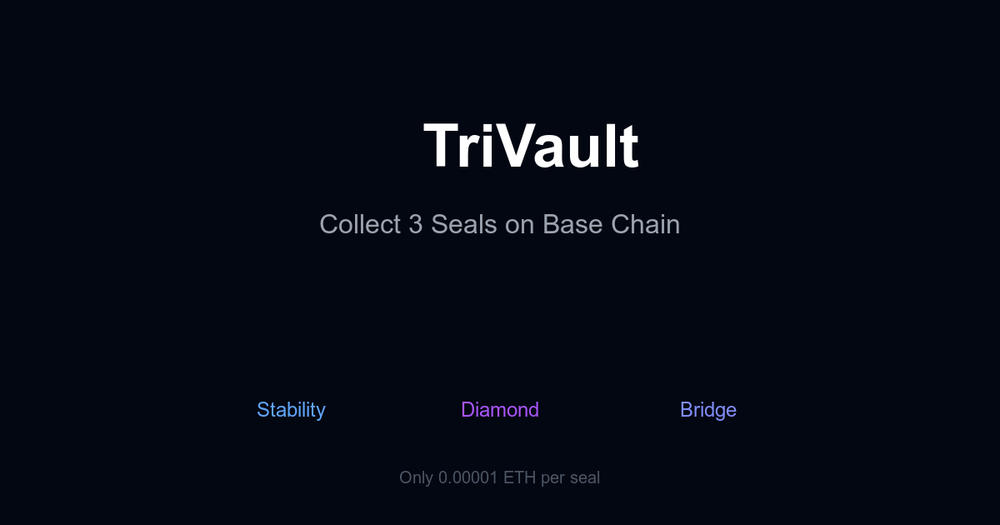

# 🔐 TriVault

A fun on-chain seal collection game built on Base blockchain and Farcaster.



## ✨ Features

- **🎮 Seal Collection**: Interact with 3 unique vault contracts to collect seals
- **🏆 Leaderboard**: Compete with other collectors to climb the ranks
- **📊 Statistics**: Real-time stats from the blockchain
- **🎖️ Achievements**: Unlock achievements as you progress
- **📱 Farcaster Native**: Works seamlessly as a Farcaster mini-app
- **⚡ Base Chain**: Fast and cheap transactions on Ethereum L2

## 🚀 Quick Start

### Prerequisites

- Node.js 18+
- npm or yarn
- A wallet with Base ETH

### Installation

```bash
# Clone the repository
git clone https://github.com/yourusername/trivault.git
cd trivault

# Install dependencies
npm install

# Set up environment variables
cp .env.example .env.local
# Edit .env.local with your values

# Run the development server
npm run dev
```

Open [http://localhost:3000](http://localhost:3000) to see the app.

## 🔧 Configuration

Create a `.env.local` file with:

```env
# App URL (for OG images and sharing)
NEXT_PUBLIC_APP_URL=http://localhost:3000

# WalletConnect Project ID (get one at https://cloud.walletconnect.com)
NEXT_PUBLIC_WC_PROJECT_ID=your_project_id
```

## 📁 Project Structure

```
trivault/
├── src/
│   ├── app/                 # Next.js App Router pages
│   │   ├── page.tsx         # Home page
│   │   ├── leaderboard/     # Leaderboard page
│   │   ├── stats/           # Statistics page
│   │   ├── profile/         # User profile page
│   │   ├── about/           # About page
│   │   └── faq/             # FAQ page
│   ├── components/          # React components
│   │   ├── ui/              # Reusable UI components
│   │   ├── VaultGrid.tsx    # Main seal collection UI
│   │   ├── Leaderboard.tsx  # Leaderboard component
│   │   └── ...
│   ├── config/              # Configuration files
│   │   ├── contracts.ts     # Smart contract ABIs and addresses
│   │   └── wagmi.ts         # wagmi configuration
│   ├── hooks/               # Custom React hooks
│   └── lib/                 # Utility functions
├── contracts/               # Solidity smart contracts
├── public/                  # Static assets
└── tools/                   # Deployment and utility scripts
```

## 🔗 Smart Contract

The TriVault smart contract is deployed on Base:

- **Address**: `0xC3319C80FF4fC435ca8827C35A013E64B762ff48`
- **Network**: Base Mainnet
- **Fee**: 0.00001 ETH per seal

### Contract Functions

| Function | Description |
|----------|-------------|
| `collectSeal(uint8 vaultNumber)` | Collect a seal (1, 2, or 3) |
| `getUserSeals(address user)` | Get user's seal status |
| `hasAllSeals(address user)` | Check if user has all seals |
| `getStats()` | Get contract statistics |

## 🛠️ Tech Stack

- **Frontend**: Next.js 14, React 18, TypeScript
- **Styling**: Tailwind CSS
- **Web3**: wagmi, viem
- **State**: TanStack Query
- **Integration**: Farcaster Mini-App SDK

## 📱 Farcaster Integration

TriVault works as a native Farcaster mini-app:

1. Auto-connects to Farcaster wallet when opened in Warpcast
2. Share progress directly to your Farcaster feed
3. Frame metadata for rich link previews

## 🧪 Development

```bash
# Run development server
npm run dev

# Build for production
npm run build

# Run linting
npm run lint

# Type checking
npx tsc --noEmit
```

## 🚀 Deployment

### Vercel (Recommended)

1. Push your code to GitHub
2. Import the repository in Vercel
3. Set environment variables
4. Deploy!

### Manual Deployment

```bash
npm run build
npm start
```

## 🤝 Contributing

Contributions are welcome! Please:

1. Fork the repository
2. Create a feature branch (`git checkout -b feature/amazing-feature`)
3. Commit your changes (`git commit -m 'feat: add amazing feature'`)
4. Push to the branch (`git push origin feature/amazing-feature`)
5. Open a Pull Request

## 📜 License

MIT License - see [LICENSE](LICENSE) for details.

## 🙏 Acknowledgments

- [Base](https://base.org) - Ethereum L2
- [Farcaster](https://farcaster.xyz) - Decentralized social
- [wagmi](https://wagmi.sh) - React Hooks for Ethereum
- [Next.js](https://nextjs.org) - React Framework

---

Built with ❤️ on Base
